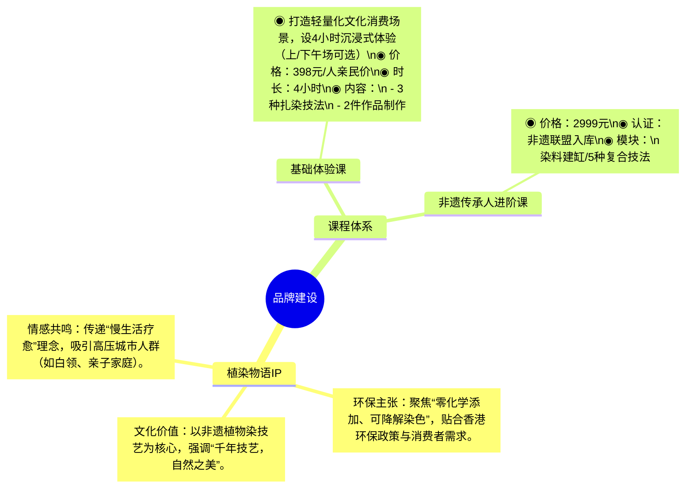
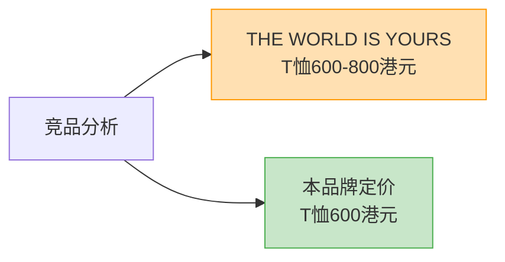
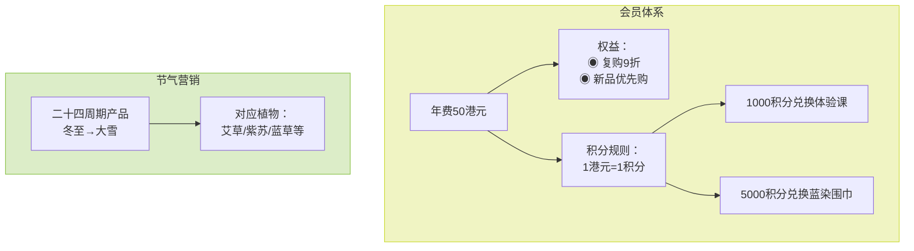

以下是针对营销策略四个模块的可视化方案，采用组合图表形式清晰呈现结构化信息：

### 4.1 品牌建设策略图


### 4.2 定价策略对比表


### 4.3 渠道策略矩阵
```mermaid
flowchart LR
    subgraph 线下
        A[PMQ元创坊实体店\n"沉浸式文化空间"]
    end
    subgraph 线上
        B["电商双平台\nEtsy Hong Kong | Ztore"]
    end
    style 线下 fill:#f8bbd0,stroke:#e91e63
    style 线上 fill:#b3e5fc,stroke:#03a9f4
```

### 4.4 促销策略组合图


**图表设计说明：**
1. **差异化视觉编码**：
   - 绿色系：文化价值相关模块
   - 橙色系：价格对比强调
   - 红蓝CP：O2O渠道策略
   - 黄绿渐变：促销组合策略

2. **信息层级处理**：
   - 核心数据突出显示（价格/时长）
   - 使用图标(◉)提升可读性
   - 关键转化路径用箭头标注

3. **扩展建议**：
   - 添加数据标签（如会员转化率）
   - 嵌入真实产品图片（需HTML扩展）
   - 增加动态时间轴（节气产品周期）

如果需要将四个模块整合为**一张战略地图**，可采用泳道图形式展示各策略模块的协同关系，我可提供整合方案。
