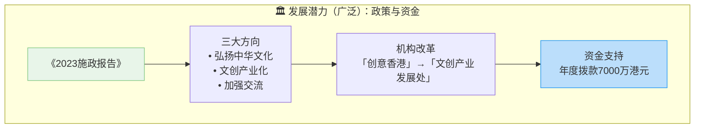
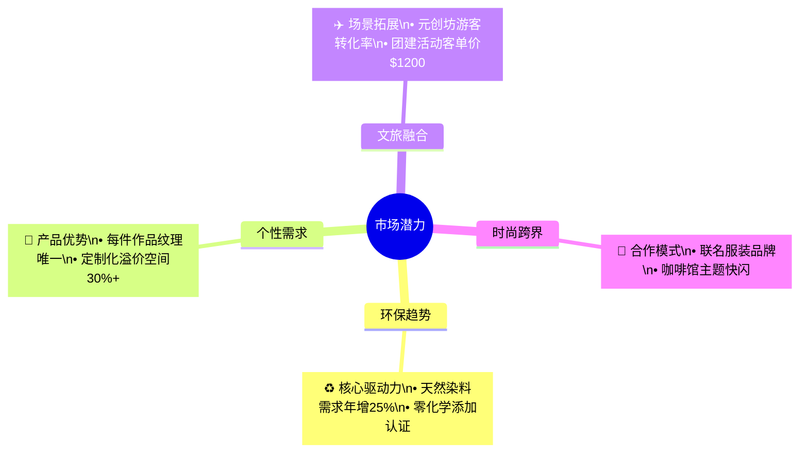
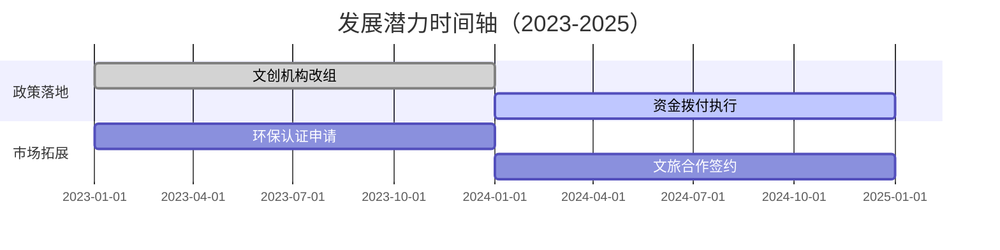

以下是针对发展潜力内容的 **双维度图表方案**，结合政策支持与市场机遇的可视化呈现：

---

### **1. 宏观发展潜力（政策与资金支持）**

---

### **2. 具体市场机遇（四大潜力领域）**

---

### **组合图表说明**
| 维度         | 呈现形式          | 关键数据点                     |
|--------------|-------------------|-------------------------------|
| **政策支持** | 横向流程箭头图    | 政策三大方向→机构改革→资金落地 |
| **市场机遇** | 放射状思维导图    | 四大领域核心价值+量化指标      |

---

### **增强版建议（如需更详细展示）**

**设计亮点：**
1. **颜色区分维度**：
   - 绿色：环保相关领域
   - 蓝色：政策与资金
   - 橙色：市场合作场景

2. **数据锚点**：
   - 标注具体金额（7000万港元）
   - 量化市场增长（年增25%）
   - 溢价空间提示（30%+）

3. **可交互扩展**：
   - 点击政策节点可展开具体措施
   - 悬停市场领域显示竞品对比

如需调整为纵向布局或增加SWOT分析层，可进一步优化图表结构。
