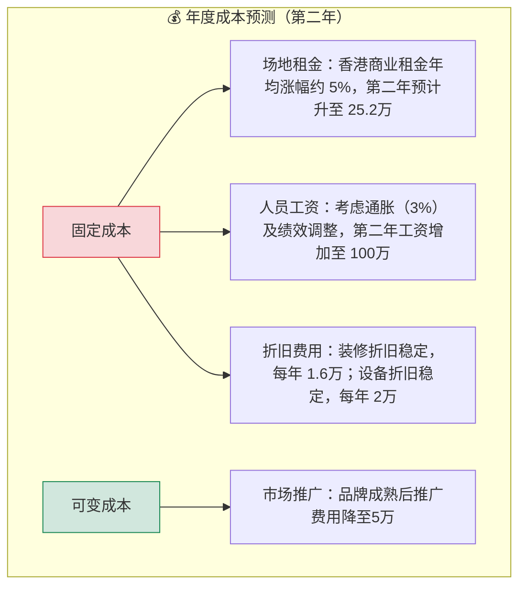
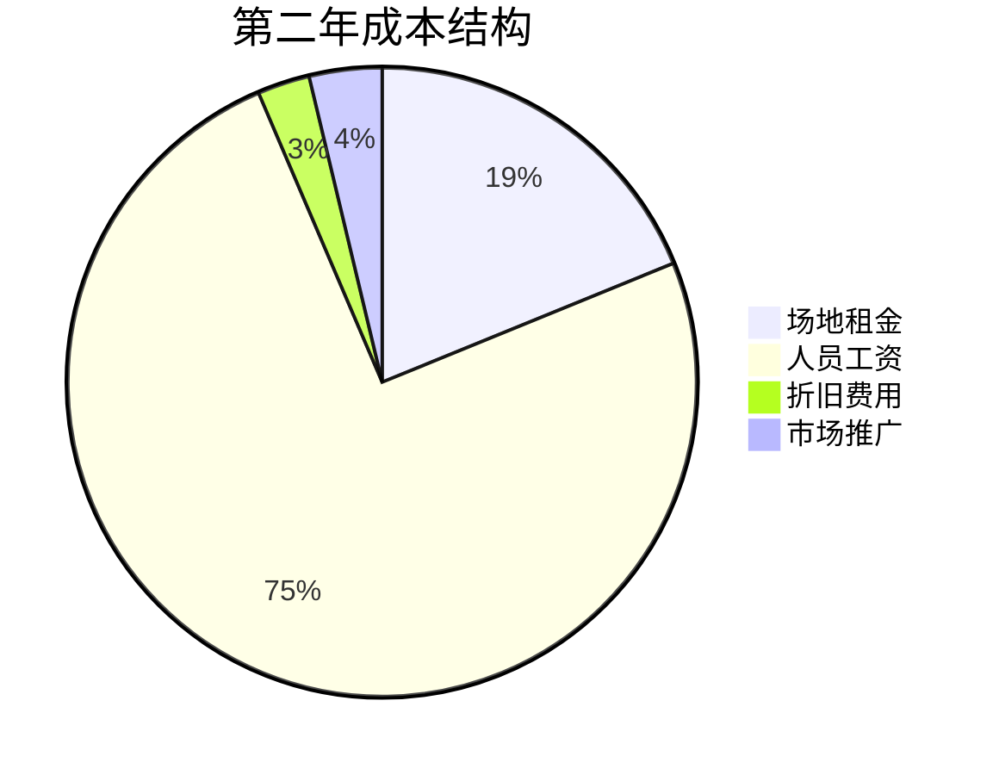

以下是成本预测的可视化图表方案：

### 1. 成本结构树状图

### 2. 成本占比饼图

### 3. 成本变化对比表

```mermaid
gantt
    title 成本年度变化（单位：万港元）
    dateFormat  X
    axisFormat %s
    section 固定成本
    场地租金 : 24, 25.2
    人员工资 : 97, 100
    折旧费用 : crit, 3.6, 3.6
    section 可变成本
    市场推广 : 7, 5
```

**图表说明：**
1. **树状图**：清晰区分固定/可变成本，标注涨幅原因
2. **饼图**：直观显示各成本项占比（需按实际数据调整）
3. **甘特图**：对比年度变化，红色标注稳定支出

**关键数据突出：**
- 用↑↓箭头表示成本变动方向
- 通胀影响单独标注（+3%/年）
- 品牌成熟度与推广费的反比关系

可根据实际数据调整数值，或增加第三年预测曲线。
