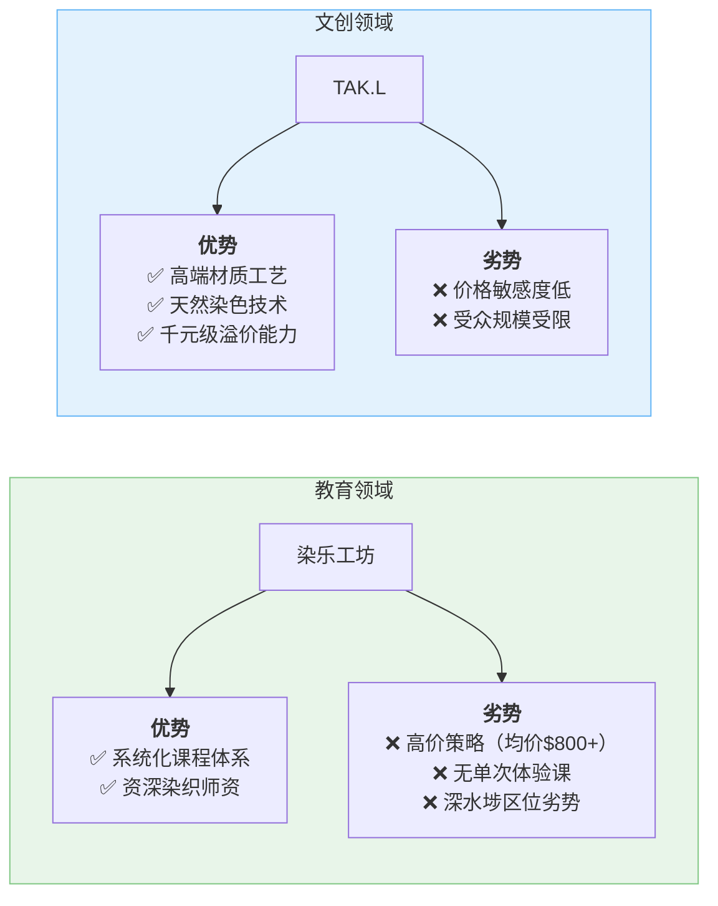
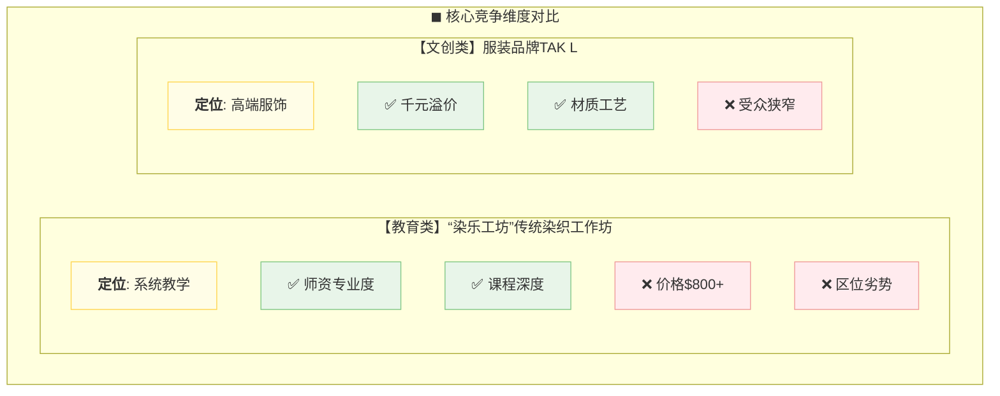
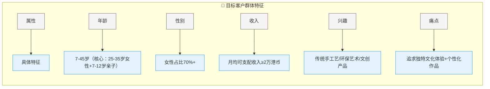
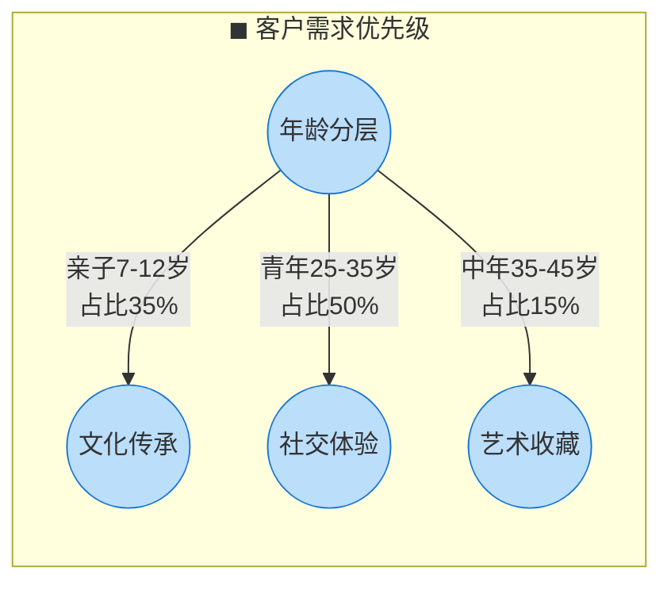

以下是针对竞争分析的 **双维度对比图表**，采用Mermaid语法实现横向竞品对标：

### 竞争分析对比图


### 增强版表格对比（备用方案）


**图表亮点说明：**
1. **双色区分领域**：教育（绿色系）vs 文创（蓝色系）
2. **符号化标注**：
   - ✅ 优势项用绿色对勾
   - ❌ 劣势项用红色叉号
3. **关键数据强化**：
   - 突出价格锚点（$800+/千元级）
   - 标注核心竞争维度（系统教学/高端服饰）

**扩展建议：**
- 可增加SWOT四象限图展示全局竞争态势
- 添加市场占有率数据标签（若有）
- 用价格带曲线对比定位差异

如需调整对比维度或增加产品线细节，可告知具体需求方向。

以下是针对目标客户群体的 **多维度用户画像图表**，采用Mermaid语法实现可视化呈现：

### 1. 客户群体雷达图（核心特征）
```mermaid
radarChart
    title 目标客户群体画像
    axis 年龄分布,性别比例,收入水平,艺术兴趣,需求痛点
    "染乐工坊" : 90, 70, 80, 95, 85
    scale 0,100
    fill "染乐工坊" #81c78455
    stroke "染乐工坊" #81c784
```

### 2. 详细属性分解图


### 3. 客户需求气泡图（备选方案）


**图表设计说明：**
1. **可视化编码**：
   - 绿色系：核心客户特征（雷达图）
   - 蓝灰配：结构化属性分解（流程图）
   - 气泡大小：需求强度量化（备选方案）

2. **关键数据突出**：
   - 用百分比标注性别比例
   - 收入水平转化为具体数值标准
   - 年龄分段显示核心区间

3. **交互扩展建议**：
   - 可增加「客户旅程地图」展示参与动机
   - 添加真实用户语录作为悬浮注释
   - 用图标区分不同年龄段特征

如需调整维度权重或增加竞品对比层，可提供具体参数优化图表。
