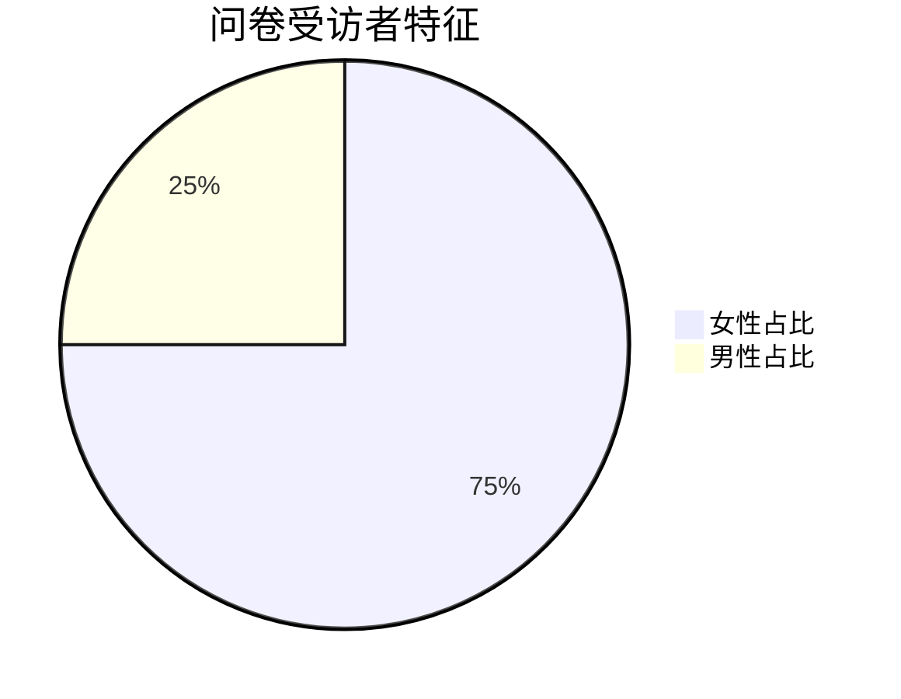
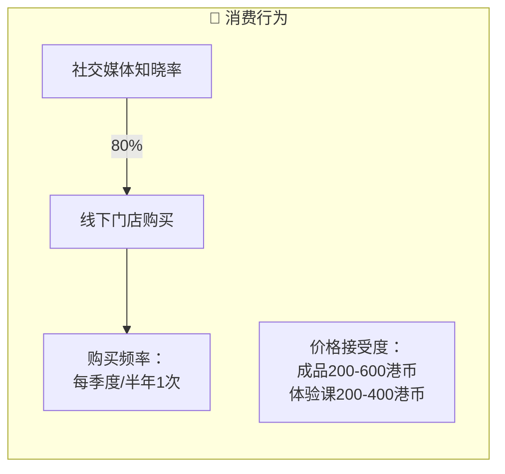
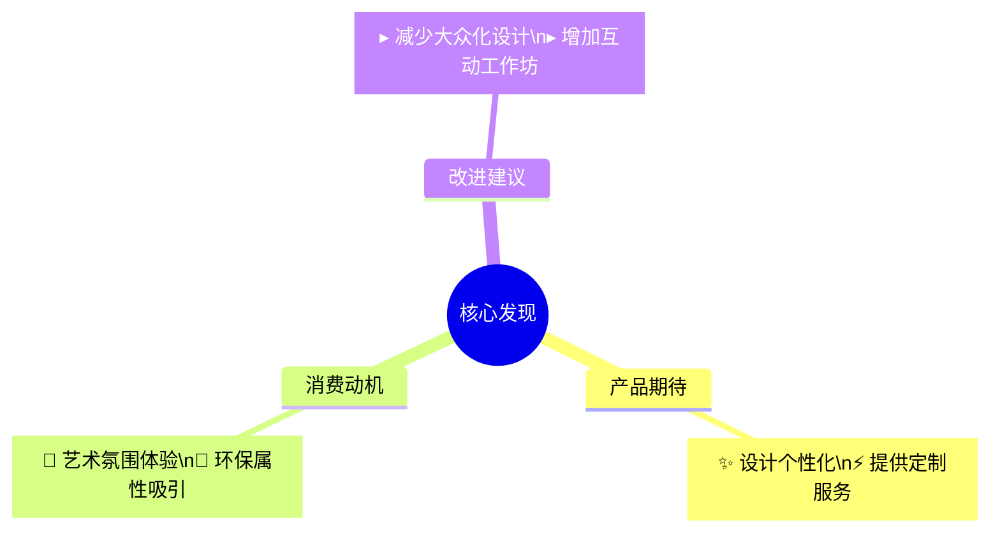

以下是简化后的 **消费者画像图表**，采用Mermaid语法直观呈现问卷核心数据：

**图表说明：**
1. **基础画像**：饼图快速显示性别比例
2. **消费行为**：流程图串联从认知到购买的闭环
3. **需求洞察**：思维导图归类用户建议

**关键数据保留：**
- 价格敏感区间（200-600港币）
- 社交媒体主导的认知路径（80%）
- 季度性消费习惯

如需强调年龄分布或收入层级，可增加横向柱状图。
