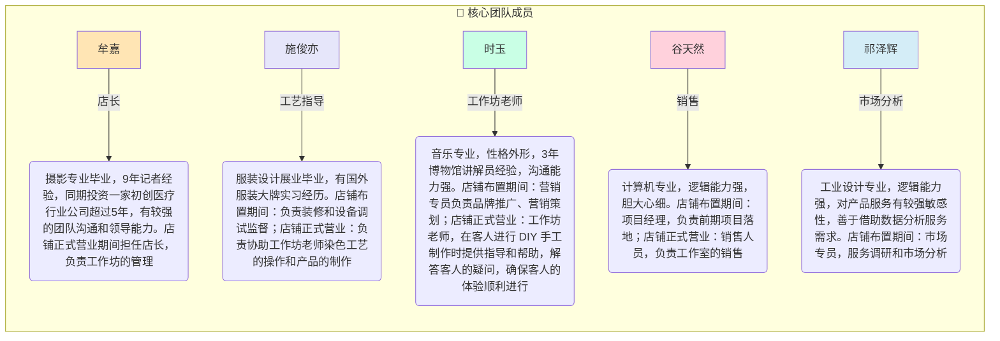

以下是团队成员简历的可视化图表方案：

### 1. 团队职能矩阵图


### 2. 成员能力雷达图（示例：牟嘉）
```mermaid
radarChart
    title 牟嘉 - 能力维度
    axis 领导力,沟通力,行业经验,项目管理,创意能力
    "能力值" : 9, 8, 7, 6, 5
    scale 0,10
```

### 3. 简洁版团队卡片
```mermaid
mindmap
  root((团队成员))
    牟嘉
      ["📌 店长"
      "🎓 摄影专业+9年记者"
      "💼 医疗行业投资者"]
    施俊亦
      ["🎨 工艺指导"
      "👔 服装设计专业"
      "🏷️ 大牌实习经历"]
    时玉
      ["🎵 工作坊老师"
      "🏛️ 博物馆讲解员"
      "💬 沟通专家"]
    谷天然
      ["💻 销售"
      "🔧 计算机专业"
      "📦 项目落地"]
    祁泽辉
      ["📊 市场分析"
      "📐 工业设计"
      "🔍 数据敏感"]
```

**图表说明：**
1. 采用三种可选形式：
   - 流程图：展示岗位分工关系
   - 雷达图：重点成员能力可视化（可复制修改其他成员）
   - 思维导图：简洁名片式展示

2. 设计特点：
   - 使用职业图标增强识别度（🎨=设计，💻=IT等）
   - 不同岗位用不同底色区分
   - 保留关键学历/经历标签

3. 扩展建议：
   - 可增加「项目时间轴」显示各成员在店铺筹备期/运营期的贡献
   - 用柱状图对比成员核心能力值
   - 添加照片占位符（需配合HTML使用）
