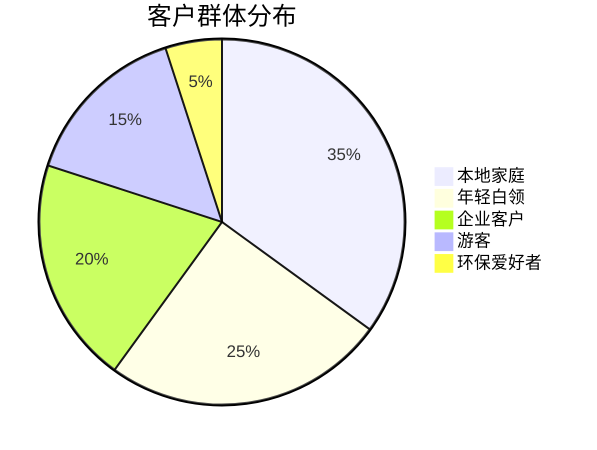
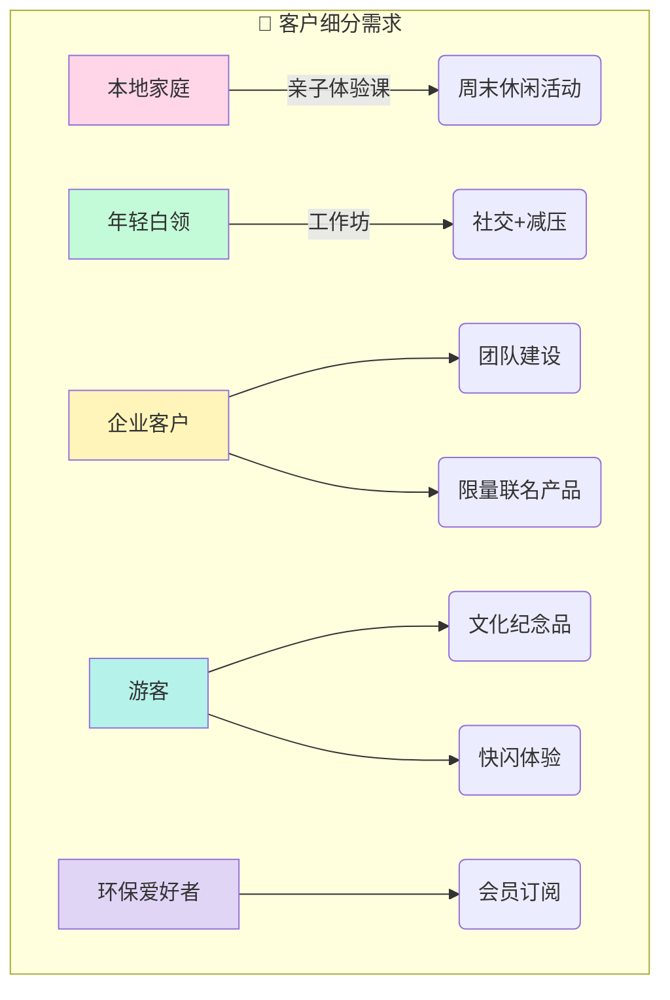
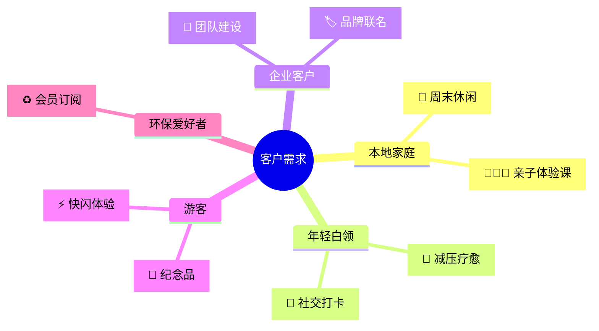

以下是客户细分需求的简单可视化图表：

```mermaid
pie
    title 客户群体分布
    "本地家庭" : 35
    "年轻白领" : 25
    "企业客户" : 20
    "游客" : 15
    "环保爱好者" : 5
```

```mermaid
flowchart TD
    subgraph 客户需求["🎯 客户细分需求"]
        A[本地家庭] -->|亲子体验课| A1("周末休闲活动")
        B[年轻白领] -->|工作坊| B1("社交+减压")
        C[企业客户] --> C1("团队建设")
        C --> C2("限量联名产品")
        D[游客] --> D1("文化纪念品")
        D --> D2("快闪体验")
        E[环保爱好者] --> E1("会员订阅")
    end
    style A fill:#FFD6E7
    style B fill:#C3FBD8
    style C fill:#FFF5BA
    style D fill:#B5F2EA
    style E fill:#E1D5F6
```

或者更简洁的版本：

```mermaid
mindmap
  root((客户需求))
    本地家庭
      ["👨‍👩‍👧 亲子体验课"]
      ["🛝 周末休闲"]
    年轻白领
      ["💆 减压疗愈"]
      ["📸 社交打卡"]
    企业客户
      ["👥 团队建设"]
      ["🏷️ 品牌联名"]
    游客
      ["🎁 纪念品"]
      ["⚡ 快闪体验"]
    环保爱好者
      ["♻️ 会员订阅"]
```

图表说明：
1. 饼图展示客户群体比例分布（数字可调整）
2. 流程图详细展示每类客户的核心需求
3. 思维导图版本更简洁直观
4. 使用emoji图标增强可读性
5. 不同客户类型用不同颜色区分

可根据需要选择最适合的图表形式，或调整比例数据。
