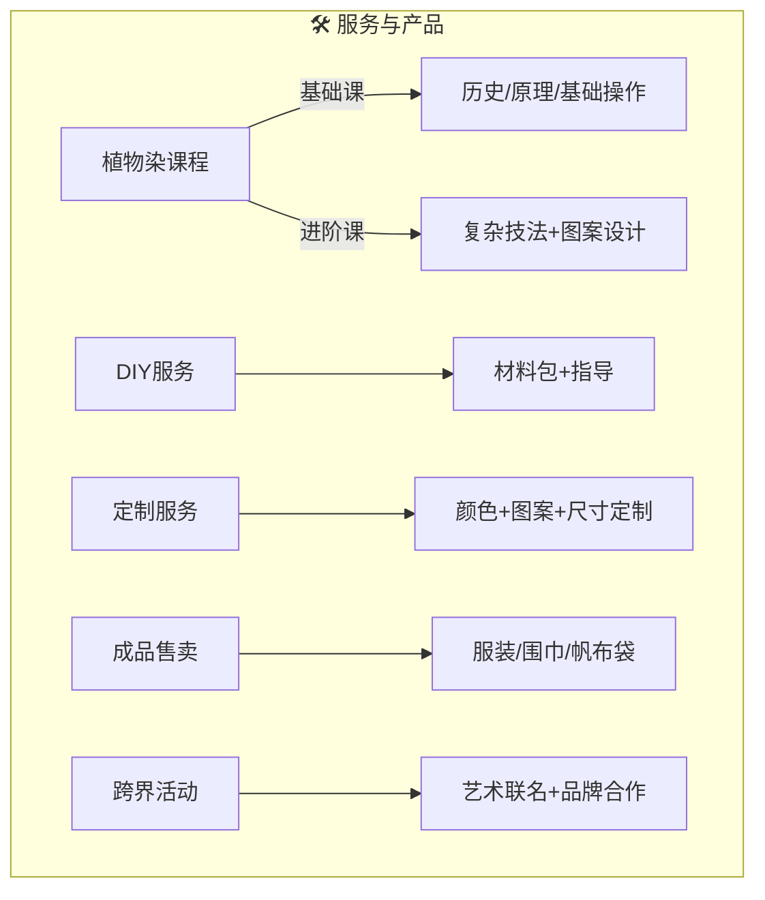
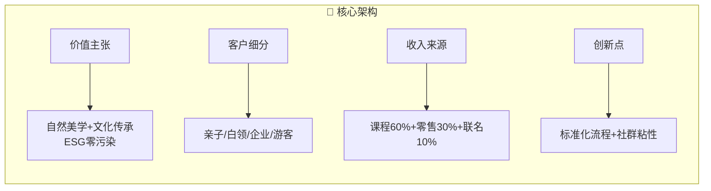
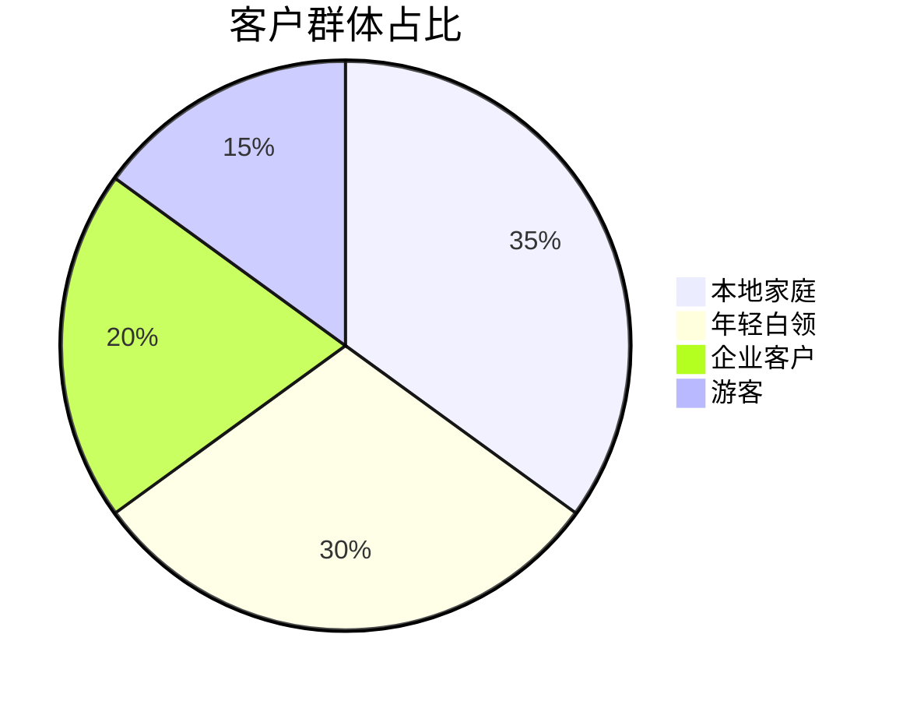

以下是简化后的 **产品服务与商业模式图表**，采用模块化设计清晰展示核心要素：

### 1. 产品服务矩阵图

### 2. 商业模式四象限图

### 3. 客户需求气泡图

**图表特点：**
1. **产品服务**：用流程图分类五大业务模块，箭头表示服务升级路径
2. **商业模式**：采用经典四象限模型，百分比显示收入结构
3. **客户分析**：饼图直观显示主力客群比例

**关键数据保留：**
- 课程分级（基础/进阶）
- 收入结构比例
- 四大核心客群

如需强调ESG价值或联名案例，可增加图标化案例展示栏。
