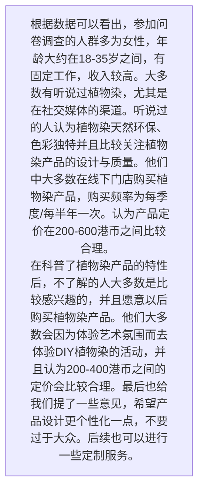

```mermaid
flowchart LR
    A[根据数据可以看出，参加问卷调查的人群多为女性，年龄大约在18-35岁之间，有固定工作，收入较高。大多数有听说过植物染，尤其是在社交媒体的渠道。听说过的人认为植物染天然环保、色彩独特并且比较关注植物染产品的设计与质量。他们中大多数在线下门店购买植物染产品，购买频率为每季度/每半年一次。认为产品定价在200-600港币之间比较合理。 
在科普了植物染产品的特性后，不了解的人大多数是比较感兴趣的，并且愿意以后购买植物染产品。他们大多数会因为体验艺术氛围而去体验DIY植物染的活动，并且认为200-400港币之间的定价会比较合理。最后也给我们提了一些意见，希望产品设计更个性化一点，不要过于大众。后续也可以进行一些定制服务。 ]
```
