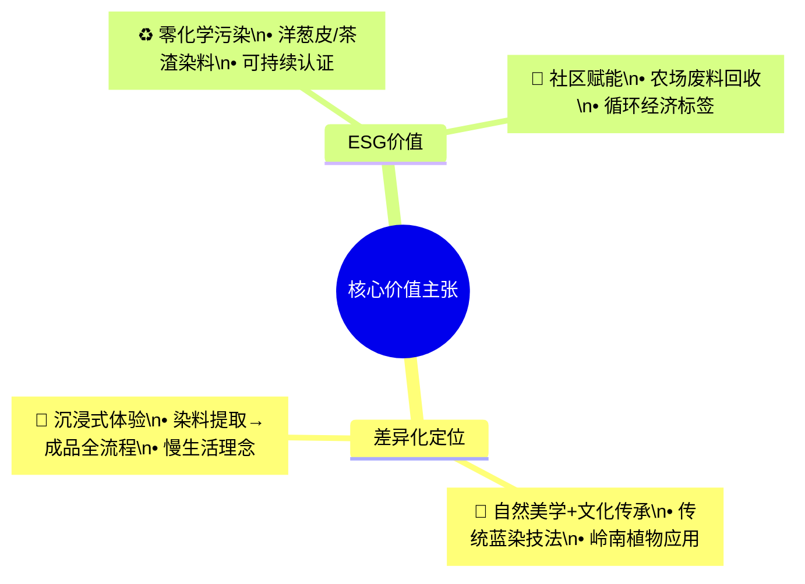
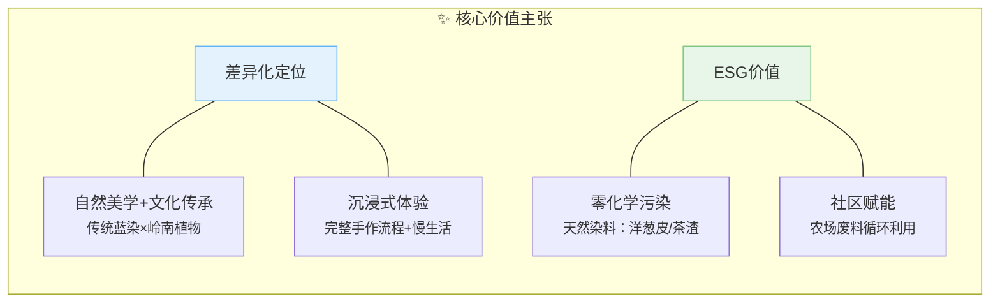

以下是核心价值主张的简化图表呈现：

```mermaid
mindmap
  root((核心价值主张))
    差异化定位
      ["🌿 自然美学+文化传承\n• 传统蓝染技法\n• 岭南植物应用"]
      ["🎨 沉浸式体验\n• 染料提取→成品全流程\n• 慢生活理念"]
    ESG价值
      ["♻️ 零化学污染\n• 洋葱皮/茶渣染料\n• 可持续认证"]
      ["🤝 社区赋能\n• 农场废料回收\n• 循环经济标签"]
```

或采用更直观的双栏对比形式：

```mermaid
flowchart LR
    subgraph 价值主张["✨ 核心价值主张"]
        direction TB
        A[差异化定位] --- B["自然美学+文化传承\n<small>传统蓝染×岭南植物</small>"]
        A --- C["沉浸式体验\n<small>完整手作流程+慢生活</small>"]
        D[ESG价值] --- E["零化学污染\n<small>天然染料：洋葱皮/茶渣</small>"]
        D --- F["社区赋能\n<small>农场废料循环利用</small>"]
    end
    style A fill:#e3f2fd,stroke:#64b5f6
    style D fill:#e8f5e9,stroke:#81c784
```

图表特点：
1. 用颜色区分两大维度（蓝色-差异化/绿色-ESG）
2. 图标化关键要素（🌿♻️等）
3. 保留所有核心关键词和案例
4. 小字号显示补充说明（兼容移动端查看）

如需调整为纵向排列或增加具体数据标签，可进一步调整图表结构。
