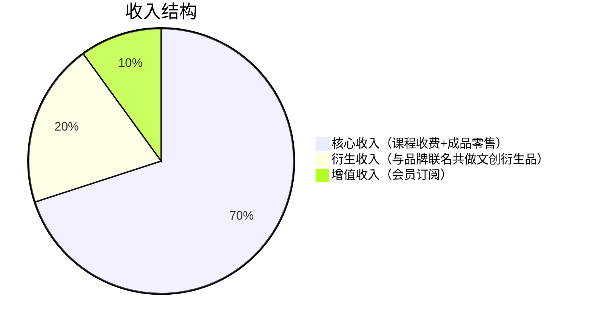
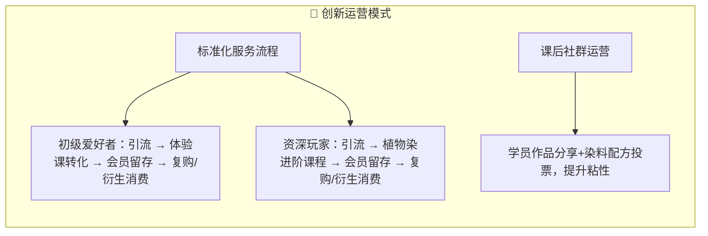
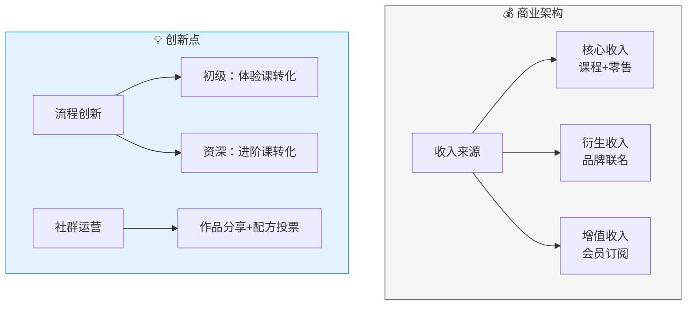

以下是收入来源与创新点的可视化图表方案：

### 1. 收入来源占比图

```mermaid
pie
    title 收入结构
    "核心收入（课程收费+成品零售）" : 70
    "衍生收入（与品牌联名共做文创衍生品）" : 20
    "增值收入（会员订阅）" : 10
```

### 2. 服务流程与创新点图

```mermaid
flowchart LR
    subgraph 创新点["🔄 创新运营模式"]
        direction TB
        A[标准化服务流程] --> B["初级爱好者：引流 → 体验课转化 → 会员留存 → 复购/衍生消费"]
        A --> C["资深玩家：引流 → 植物染进阶课程 → 会员留存 → 复购/衍生消费"]
        D[课后社群运营] --> E["学员作品分享+染料配方投票，提升粘性"]
    end
```

### 组合版本（一体化展示）

```mermaid
flowchart TD
    subgraph 商业模式["💰 商业架构"]
        收入来源 --> 核心["核心收入\n课程+零售"]
        收入来源 --> 衍生["衍生收入\n品牌联名"]
        收入来源 --> 增值["增值收入\n会员订阅"]
    end
    subgraph 创新模式["💡 创新点"]
        流程创新 --> 初级路径["初级：体验课转化"]
        流程创新 --> 资深路径["资深：进阶课转化"]
        社群运营 --> 互动["作品分享+配方投票"]
    end
    style 商业模式 fill:#f5f5f5,stroke:#616161
    style 创新模式 fill:#e3f2fd,stroke:#2196f3
```

**图表特点：**
1. 收入结构采用饼图直观显示比例
2. 服务流程用双向箭头表示用户成长路径
3. 组合版用灰蓝配色区分商业与创新模块
4. 关键环节用图标强化记忆点（💰💡等）

可根据实际收入比例调整饼图数据，或增加具体金额标签。
