以下是针对您提供的运营管理内容设计的可视化方案，采用多维度图表呈现关键信息：

1. **课程体系对比表**

2. **教学流程时间轴**

```mermaid
gantt
    title 课程时间分配对比
    dateFormat  HH:mm
    section 课前准备
    进阶课程需提前1天确认学员名单，准备染料、布料及工具包。:b1, 00:00, 360m
    section DIY体验课
    理论讲解       :a1, 00:00, 30m
    实操指导       :a2, after a1, 60m
    作品展示       :a3, after a2, 30m
    section 进阶课程
    全天教学       :b1, 00:00, 360m
    section 课后跟进
    通过社群发送课程回顾视频，收集学员反馈优化内容。 :b1, 00:00, 360m
```

3. **采购销售流程图**

4. **人员结构矩阵**

5. **绩效考核指标表**

6. **场地功能分区图**

7. **设备管理甘特图**

8. **成本控制策略图**

建议搭配使用的可视化组合：
1. 课程体系双轴图（柱状图+折线图）展示课程容量与频次关系
2. 采购供应链桑基图显示原料流向
3. 人员能力雷达图对比不同岗位要求
4. 场地热力图优化功能分区

需要特别用颜色区分的要点：
- 红色：安全相关（设备维护、染料储存）
- 蓝色：创收模块（会员特权、场地出租）
- 绿色：教学相关（课程流程、培训体系）

是否需要针对某个具体模块（如会员权益结构或非遗作品采购流程）制作更详细的交互式图表？可以进一步优化展示维度。
