以下是针对竞争分析的 **双维度对比图表**，采用Mermaid语法实现横向竞品对标：

### 竞争分析对比图

### 增强版表格对比（备用方案）

```mermaid
flowchart TD
    classDef comp fill:#fffde7,stroke:#ffd54f
    classDef pros fill:#e8f5e9,stroke:#81c784
    classDef cons fill:#ffebee,stroke:#ef9a9a

    subgraph 竞争维度对比["◼ 核心竞争维度对比"]
        direction LR
        subgraph 教育竞品["【教育类】“染乐工坊”位于香港深水埗的一家专注于传统染织技艺的工作坊，提供植物染、扎染等多种课程。"]
            A1["<b>定位</b>: 系统教学"]:::comp
            A2["✅ 师资专业度"]:::pros
            A3["✅ 课程深度"]:::pros
            A4["❌ 价格$800+"]:::cons
            A5["❌ 区位劣势"]:::cons
        end

        subgraph 文创竞品["【文创类】服装品牌TAK L.创立于2018年，以高质量材质、颜色、纹理和工艺为设计核心，运用天然染色和多种布料。"]
            B1["<b>定位</b>: 高端服饰"]:::comp
            B2["✅ 千元溢价"]:::pros
            B3["✅ 材质工艺"]:::pros
            B4["❌ 受众狭窄"]:::cons
        end
    end
```

**图表亮点说明：**
1. **双色区分领域**：教育（绿色系）vs 文创（蓝色系）
2. **符号化标注**：
   - ✅ 优势项用绿色对勾
   - ❌ 劣势项用红色叉号
3. **关键数据强化**：
   - 突出价格锚点（$800+/千元级）
   - 标注核心竞争维度（系统教学/高端服饰）

**扩展建议：**
- 可增加SWOT四象限图展示全局竞争态势
- 添加市场占有率数据标签（若有）
- 用价格带曲线对比定位差异

如需调整对比维度或增加产品线细节，可告知具体需求方向。
